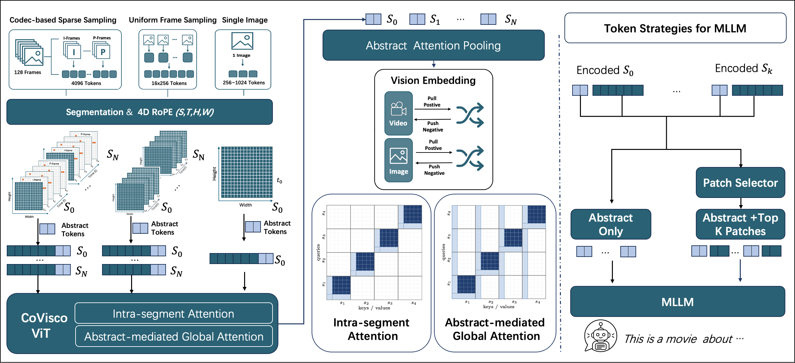
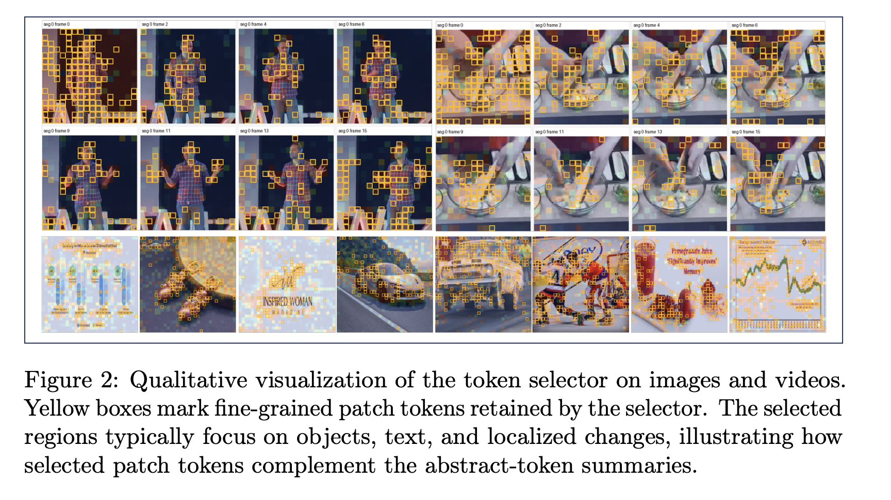
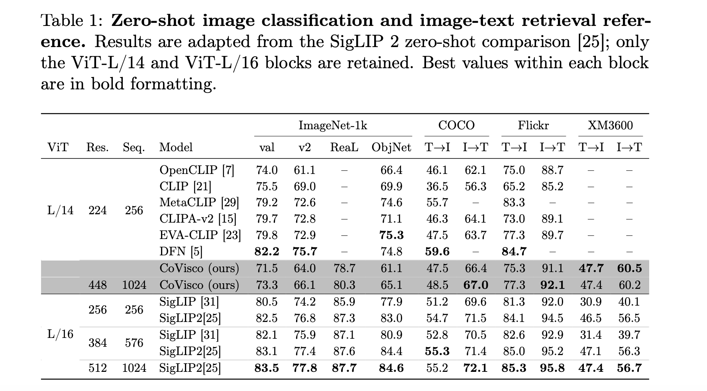
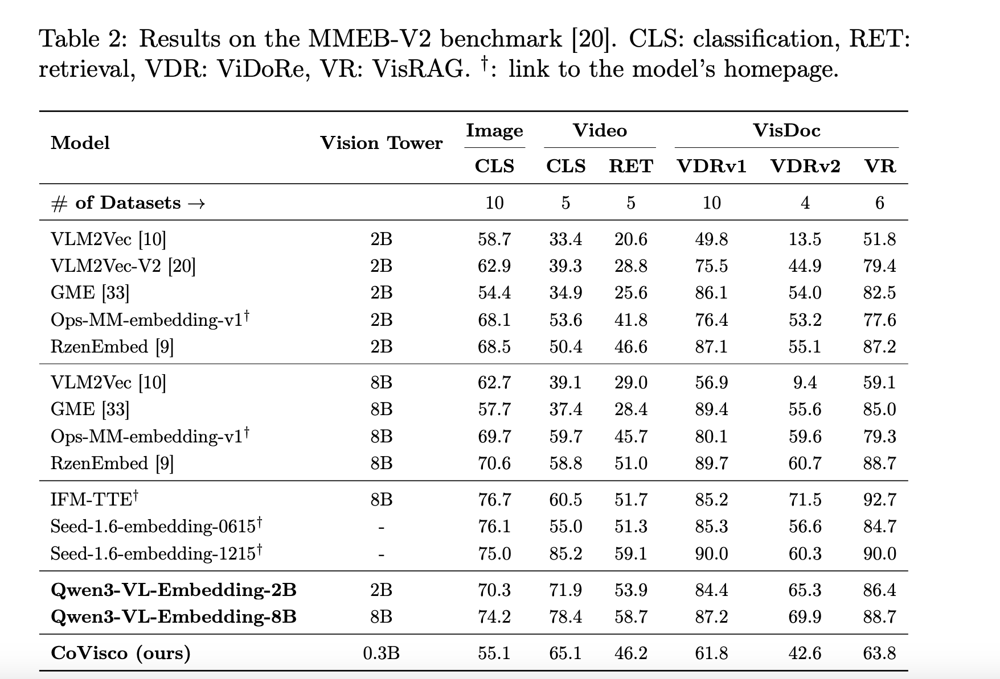
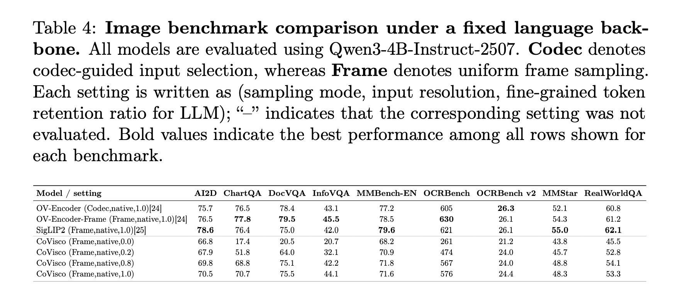
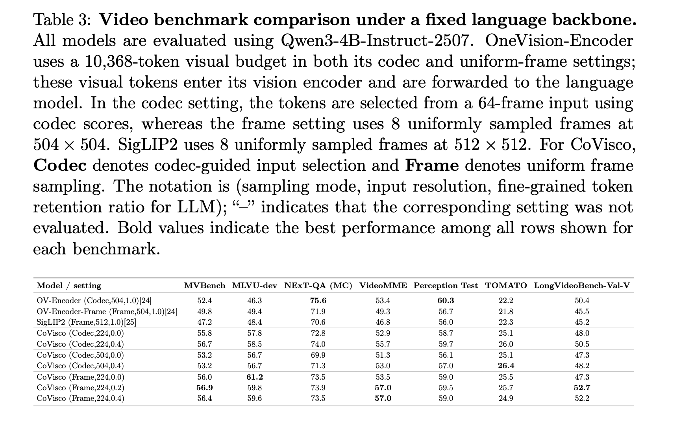
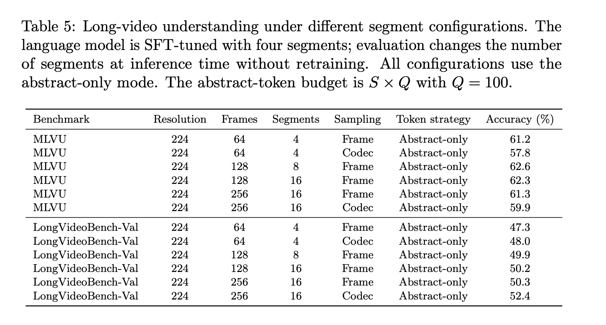

# CoVisco

**Official implementation of** *CoVisco: Codec-Native Vision Encoder with Native Token Compression for Unified Image-Video Understanding*

[](https://arxiv.org/pdf/2609.39924)
[](https://huggingface.co/ernie-research/CoVisco-L-14)

> **Model weights:** the CoVisco-L-14 vision encoder will be released on Hugging Face — [`ernie-research/CoVisco-L-14`](https://huggingface.co/ernie-research/CoVisco-L-14).

## Overview

CoVisco is a **codec-native vision encoder** that handles images and videos in a unified way and performs **native token compression** at the encoder level, producing a compact set of visual tokens for efficient downstream understanding.

<p align="center">
  
</p>

<p align="center"><em>CoVisco framework. Images and videos (codec-based sparse sampling / uniform frame sampling / single image) are segmented with 4D RoPE and encoded by the CoVisco ViT using intra-segment and abstract-mediated global attention; abstract attention pooling yields the vision embedding, and a patch selector feeds abstract-only or abstract + top-K patch tokens to the MLLM.</em></p>

Two ideas sit at the core:

- **Unified image/video encoding** — a single encoder consumes both single images and video frame sequences; videos are split into segments, with frames obtained either by **uniform frame sampling** or by **codec-based sparse sampling (HEVC/H.265)** that uses motion-vector and residual energy to keep the key patch tokens, so images and videos share one representation path.
- **Native token compression at two levels** — each segment carries learnable **abstract tokens**: inside the ViT they aggregate the segment's information and pass information across segments, acting as a compression mechanism in themselves. On top of that, a **token selector** compresses the fine-grained **patch tokens**, keeping only the key ones. Both operate at the encoder level, so the visual token count is reduced at the source before the tokens ever reach the LLM, which is where most of the efficiency gain comes from.

<p align="center">
  
</p>

<p align="center"><em>Qualitative visualization of the token selector. Yellow boxes mark the fine-grained patch tokens retained by the selector — typically focusing on objects, text, and localized changes — which complement the abstract-token summaries.</em></p>

The encoder is trained with SigLIP-style distillation (multiple contrast pairs, each with its own `logit_scale` / `logit_bias`), uses 4D  RoPE to respect spatio-temporal structure. The pretrained encoder is then attached to a Qwen3 LLM for multimodal alignment and instruction tuning.

For full method and results, see the paper: https://arxiv.org/pdf/2609.39924

## Results

### Vision Encoder (Stage 1)

Zero-shot transfer against CLIP / SigLIP-style encoders on zero-shot image classification and image retrieval:

<p align="center">
  
</p>

Multimodal embedding quality against VLM2Vec, Qwen3-VL-Embedding and other embedding models on the image and video tasks of MMEB-V2:

<p align="center">
  
</p>

### MLLM SFT (Stage 2)

Image understanding after SFT with the CoVisco encoder attached to a Qwen3 LLM:

<p align="center">
  
</p>

Video understanding after SFT (all tasks use a uniform 64 frames):

<p align="center">
  
</p>

Long-video understanding on MLVU and LongVideoBench, comparing frame counts and sampling strategies (codec vs. uniform-frame) while feeding **only the compressed summary tokens** to the LLM:

<p align="center">
  
</p>

## Repository Structure

CoVisco is organized as a **two-stage pipeline**, one subdirectory per stage:

- **[`CoVisco_ViT/`](./CoVisco_ViT) — Stage 1: Vision Encoder Pretraining.**
  Pretrains the `CoVisco-L-14` vision encoder (unified image/video encoding, query-guided token compression, SigLIP distillation). Built on [OpenCLIP](https://github.com/mlfoundations/open_clip). Includes training launch scripts and ImageNet zero-shot / video-retrieval evaluation. See [`CoVisco_ViT/README.md`](./CoVisco_ViT/README.md).

- **[`CoVisco_sft/`](./CoVisco_sft) — Stage 2: Multimodal Alignment & Instruction Tuning.**
  Attaches the pretrained `CoVisco-L-14` encoder to a Qwen3 LLM through a 2-layer MLP projector. Covers alignment, SFT, multi-node launch, and lmms-eval-based evaluation (including codec token filtering). See [`CoVisco_sft/README.md`](./CoVisco_sft/README.md).

The handoff between stages is the `CoVisco-L-14` checkpoint: Stage 2 loads it via the config's `vit.pretrained_path` and reuses the encoder (`CoViscoViT`) plus the query-guided token selector.

## Model Weights

Hugging Face weights: **coming soon** (not yet released).

<!-- 🤗 Hugging Face: TBD -->

## Getting Started

Each stage has its own environment and quick-start instructions:

```bash
# Stage 1 — pretrain the vision encoder
cd CoVisco_ViT
# see CoVisco_ViT/README.md

# Stage 2 — SFT on a Qwen3 LLM
cd CoVisco_sft
# see CoVisco_sft/README.md
```

## Citation

If you find CoVisco useful in your research, please cite:

```bibtex
@article{liu2026covisco,
  title={CoVisco: Codec-Native Vision Encoder with Native Token Compression for Unified Image-Video Understanding},
  author={Liu, Yulong and Han, Xiaotian and Shang, Junyuan and Ding, Yuchen and Zhang, Zhenyu and Wang, Shuohuan and Zhu, Guibo and Han, Sirui and Yu, Dianhai},
  journal={arXiv preprint arXiv:2609.39924},
  year={2026}
}
```
